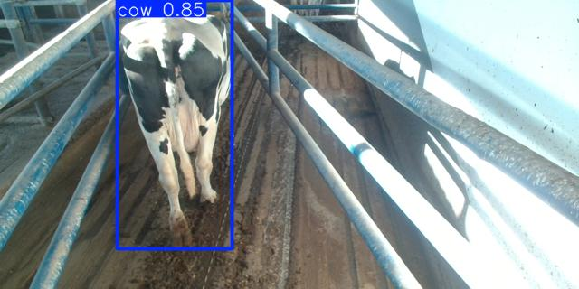
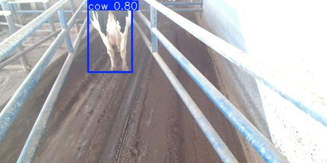
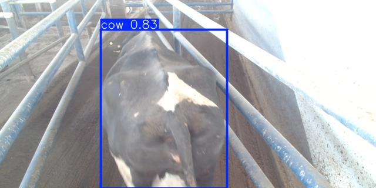
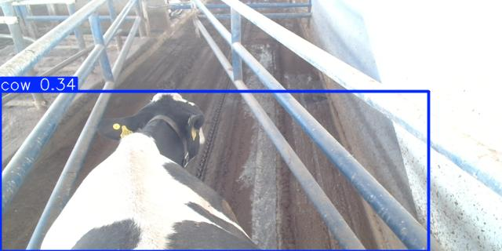

# Cattle Segmentation

## Project Overview

This project aims to analyze the behavior of dairy cows in confined walking areas using ground-level images. We apply deep learning techniques with bounding boxes to automatically detect cows, identify their posture, and determine their location within narrow corridors. By analyzing this information, we can gain insights into movement patterns, space utilization, and behavioral trends. These insights can support improvements in barn design, early detection of health or mobility issues, and the development of welfare-focused management practices.

## Getting Started

### Installation

1. Clone the repository:
```bash
git clone https://github.com/dembA7/Cattle-Segmentation.git
```

2. Install the required packages:
```bash
pip install -r requirements.txt
```

### Usage

To run the model on a sample image, simply add your image to the dataset/detect/ directory and then run the source/model_detection.ipynb file.

## Detections

Check out some real detections of the model down below!






## Repository Structure

```bash
└── demba7-cattle-segmentation/
    ├── README.md
    ├── LICENSE
    ├── requirements.txt         # Lists the required Python packages for the project
    ├── dataset/                 # Contains images from the dataset used to train the models
    │   └── detect/
    │   ├── original/
    ├── models/                  # All iterations best model weights
    │   ├── v0.pt
    │   ├── v1.pt
    │   └── v2.pt
    ├── results/
    │   ├── v1/                  # First iteration model results
    │   │   ├── hyp.yaml
    │   │   ├── opt.yaml
    │   │   ├── results.csv
    │   │   └── weights/
    │   │       ├── best.pt
    │   │       └── last.pt
    │   └── v2/                  # Second iteration model results
    │       ├── hyp.yaml
    │       ├── opt.yaml
    │       ├── results.csv
    │       ├── detected/
    │       └── weights/
    │           ├── best.pt
    │           └── last.pt
    └── source/
        ├── dataset.yaml         # Contains relative routes to dataset directories
        ├── detect.ipynb         # Detection notebook using trained models
        └── train.ipynb          # Training code for new models
```

## License 

This project is licensed under the GNU GENERAL PUBLIC LICENSE. Read [License](./LICENSE) for details.